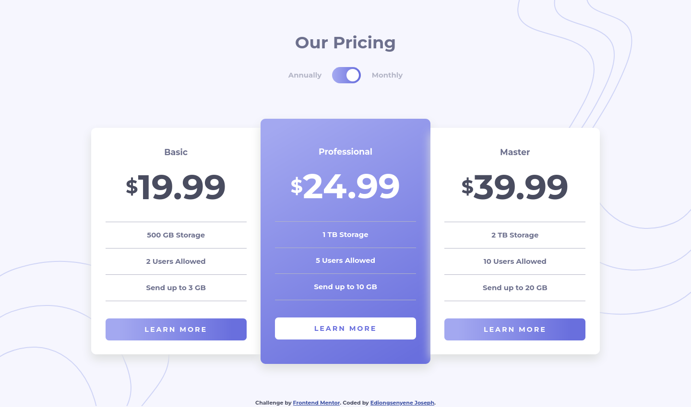

# Frontend Mentor - Pricing component with toggle solution

This is a solution to the [Pricing component with toggle challenge on Frontend Mentor](https://www.frontendmentor.io/challenges/pricing-component-with-toggle-8vPwRMIC). Frontend Mentor challenges help you improve your coding skills by building realistic projects. 

## Table of contents

- [Overview](#overview)
  - [The challenge](#the-challenge)
  - [Screenshot](#screenshot)
  - [Links](#links)
- [My process](#my-process)
  - [Built with](#built-with)
  - [Continued development](#continued-development)
  - [Useful resources](#useful-resources)
- [Author](#author)

## Overview

### The challenge

Users should be able to:

- View the optimal layout for the component depending on their device's screen size
- Control the toggle with both their mouse/trackpad and their keyboard

### Screenshot

### Links

- Solution URL: [solution URL](https://www.frontendmentor.io/solutions/responsive-pricing-component-with-a11y-toggle-using-postcss-rylGmPH85)
- Live Site URL: [live site URL](http://fem-pricing-component-with-toggle-ivory.vercel.app/)

## My process

### Built with

- Semantic HTML5 markup
- CSS custom properties
- Flexbox
- Mobile-first workflow
- [PostCSS](https://postcss.org/) with [PostCSS Preset Env](https://preset-env.cssdb.org/) - For development
- [Vite](https://vitejs.dev/) - For development

### Continued development

- Try rebuilding with React

### Useful resources

- [a111y styled form controls](https://scottaohara.github.io/a11y_styled_form_controls/) - This helped me style the form control and also opened my mind to some things I didn't know about accessibility of form controls.

## Author

- Frontend Mentor - [@IEdiong](https://www.frontendmentor.io/profile/IEdiong)
- Twitter - [@IEdiong](https://www.twitter.com/IEdiong)

